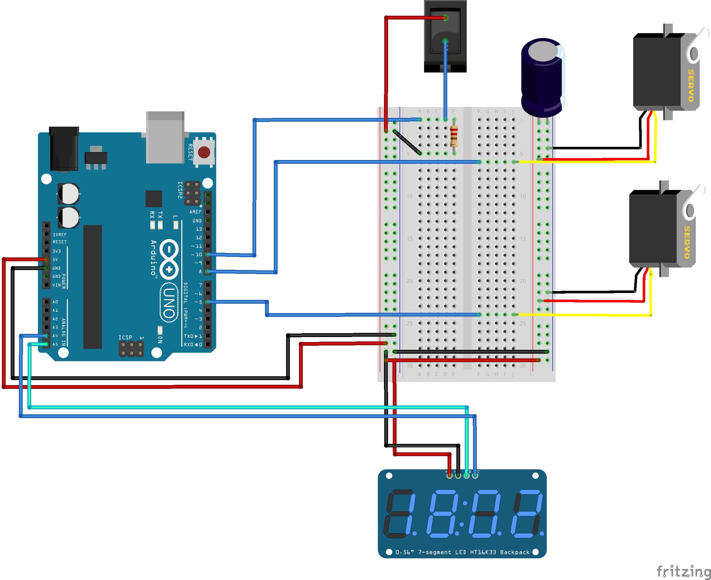

# Useless Box
Schematics and Software for the Useless Box, a useless machine.

A useless machine is a device that performs a mostly useless task, such as switching itself off, and performs no other practical function.

